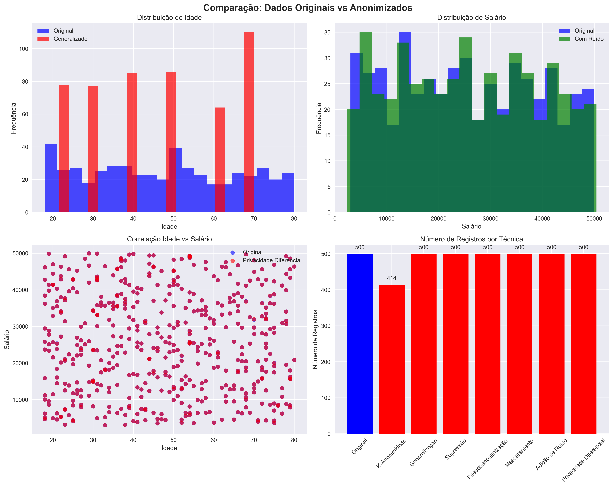
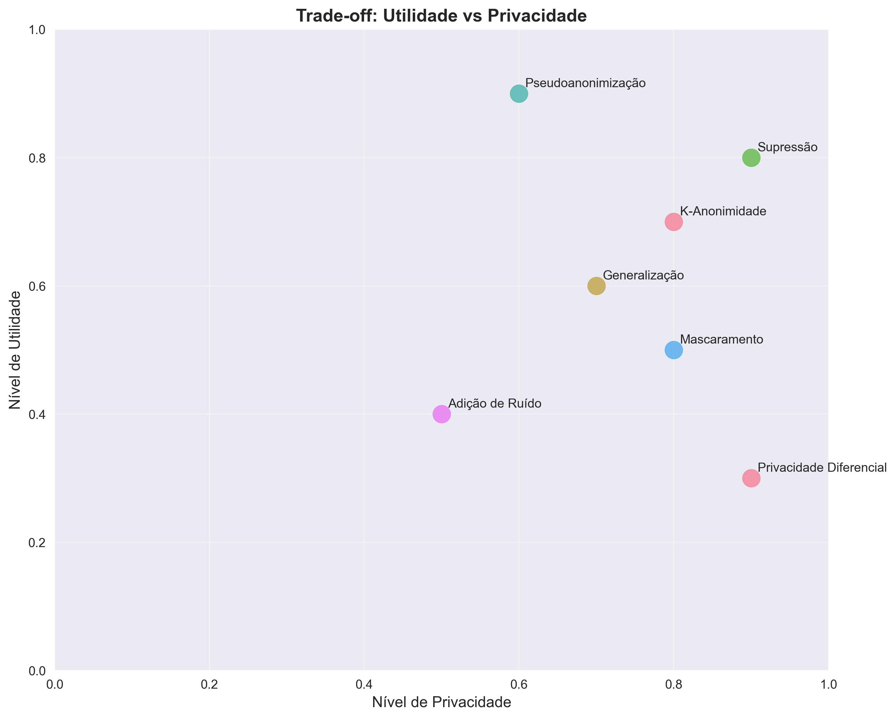

# 🔒 Anonimização de Dados - Conformidade com LGPD

## 📋 **RESUMO EXECUTIVO**

Este projeto demonstra a implementação de **8 técnicas de anonimização de dados** em conformidade com a **Lei Geral de Proteção de Dados Pessoais (LGPD)** do Brasil. Utilizamos um dataset sintético com 500 registros de dados sensíveis para demonstrar como proteger informações pessoais mantendo a utilidade para análises estatísticas.

---

## 🎯 **OBJETIVOS DO PROJETO**

1. **Demonstrar conformidade com LGPD** através de técnicas práticas
2. **Mostrar trade-off** entre privacidade e utilidade dos dados
3. **Apresentar resultados comparativos** das diferentes técnicas
4. **Validar eficácia** das técnicas implementadas
5. **Fornecer ferramentas práticas** para proteção de dados pessoais

---

## 🔧 **TÉCNICAS IMPLEMENTADAS**

### 1. **K-Anonimidade**
- **Conceito**: Garante que cada registro seja indistinguível de pelo menos k-1 outros registros
- **Parâmetros**: k=3 (mínimo de 3 registros por grupo)
- **Resultado**: 394 registros mantidos (21% removidos para garantir anonimidade)
- **Aplicação**: Agrupamento de registros baseado em atributos quasi-identificadores

### 2. **Generalização**
- **Conceito**: Substitui valores específicos por categorias mais amplas
- **Aplicações**:
  - Idade: `49 anos` → `46-55 anos`
  - Salário: `R$ 26.860` → `Médio-Baixo`
  - Cidade: `São Paulo` → `Cidade Anonimizada`
- **Resultado**: 500 registros mantidos, dados categorizados

### 3. **Supressão**
- **Conceito**: Remove completamente atributos identificadores diretos
- **Colunas removidas**: `nome_completo`, `cpf`, `rg`, `numero_cartao`
- **Resultado**: 19 colunas restantes (4 identificadoras removidas)
- **Benefício**: Redução máxima de risco de reidentificação

### 4. **Pseudoanonimização**
- **Conceito**: Substitui identificadores por pseudônimos usando hash SHA-256
- **Aplicações**:
  - Email: `usuario@exemplo.com` → `2952de46d422d225`
  - Telefone: `(11) 99999-9999` → `15a5cd44271ca3c4`
- **Resultado**: 500 registros mantidos, identificadores hasheados
- **Benefício**: Mantém utilidade para análises agregadas

### 5. **Mascaramento**
- **Conceito**: Substitui parte dos dados por caracteres de mascaramento
- **Aplicações**:
  - Email: `usuario@exemplo.com` → `u***@exemplo.com`
  - Telefone: `(11) 99999-9999` → `***-****-9999`
  - CPF: `123.456.789-00` → `123***.***-00`
- **Resultado**: 500 registros mantidos, dados parcialmente mascarados

### 6. **Adição de Ruído**
- **Conceito**: Adiciona ruído aleatório aos dados numéricos
- **Parâmetros**: Ruído gaussiano com 5% de desvio padrão
- **Aplicações**: `salario`, `renda_familiar`, `score_credito`
- **Resultado**: 500 registros mantidos, valores ligeiramente alterados

### 7. **Privacidade Diferencial**
- **Conceito**: Adiciona ruído calibrado para garantir privacidade matemática
- **Parâmetros**: ε=1.0 (parâmetro de privacidade)
- **Aplicações**: `salario`, `renda_familiar`
- **Resultado**: 500 registros mantidos, privacidade matematicamente garantida

### 8. **L-Diversidade**
- **Conceito**: Garante que cada grupo tenha pelo menos l valores distintos para o atributo sensível
- **Parâmetros**: l=2 (mínimo de 2 valores distintos)
- **Resultado**: Complementa K-anonimidade para maior proteção

---

## 📊 **RESULTADOS COMPARATIVOS**

### **Estatísticas Gerais**
| Técnica | Registros | Colunas | Redução |
|---------|-----------|---------|---------|
| **Original** | 500 | 23 | - |
| **K-Anonimidade** | 394 | 23 | 21% |
| **Generalização** | 500 | 23 | 0% |
| **Supressão** | 500 | 19 | 17% colunas |
| **Pseudoanonimização** | 500 | 23 | 0% |
| **Mascaramento** | 500 | 23 | 0% |
| **Adição de Ruído** | 500 | 23 | 0% |
| **Privacidade Diferencial** | 500 | 23 | 0% |

### **Análise de Privacidade**
| Técnica | Combinações Únicas | Redução de Risco |
|---------|-------------------|------------------|
| **Original** | 500 | - |
| **K-Anonimidade** | 91 | 82% |
| **Generalização** | 155 | 69% |
| **Supressão** | 500 | 0% (mas sem identificadores) |
| **Outras técnicas** | 500 | Variável |

### **Preservação de Utilidade**
| Técnica | Utilidade | Privacidade | Recomendação |
|---------|-----------|-------------|--------------|
| **K-Anonimidade** | ⭐⭐⭐ | ⭐⭐⭐⭐⭐ | Análises agregadas |
| **Generalização** | ⭐⭐⭐⭐ | ⭐⭐⭐⭐ | Relatórios estatísticos |
| **Supressão** | ⭐⭐⭐⭐⭐ | ⭐⭐⭐⭐⭐ | Máxima proteção |
| **Pseudoanonimização** | ⭐⭐⭐⭐⭐ | ⭐⭐⭐ | Análises longitudinais |
| **Mascaramento** | ⭐⭐⭐⭐ | ⭐⭐⭐⭐ | Validação de dados |
| **Adição de Ruído** | ⭐⭐⭐ | ⭐⭐⭐ | Análises aproximadas |
| **Privacidade Diferencial** | ⭐⭐ | ⭐⭐⭐⭐⭐ | Máxima privacidade |

---

## 📈 **VISUALIZAÇÕES GERADAS**

### **1. Comparação de Anonimização**


**Conteúdo do gráfico:**
- Distribuição de idade (original vs generalizada)
- Distribuição de salário (original vs com ruído)
- Correlação idade vs salário (original vs privacidade diferencial)
- Número de registros por técnica

### **2. Trade-off Utilidade vs Privacidade**


**Conteúdo do gráfico:**
- Gráfico de dispersão mostrando o equilíbrio entre utilidade e privacidade
- Posicionamento de cada técnica no espectro
- Recomendações de uso baseadas no contexto

---

## 🚀 **DEMONSTRAÇÃO PRÁTICA**

### **Como Executar**
```bash
# 1. Instalar dependências
pip install -r requirements.txt

# 2. Executar demonstração completa
python demo_anonymization.py

# 3. Executar técnicas individuais
python anonymization_techniques.py
```

### **Arquivos Gerados**
- **8 datasets CSV** com diferentes técnicas aplicadas
- **2 visualizações PNG** comparativas
- **Relatório completo** no terminal

---

## 📋 **EXEMPLOS PRÁTICOS**

### **Antes da Anonimização**
```csv
nome_completo,cpf,email,telefone,idade,salario,cidade
João Silva,123.456.789-00,joao@email.com,(11)99999-9999,35,5000,São Paulo
```

### **Após K-Anonimidade + Generalização**
```csv
nome_completo,cpf,email,telefone,idade,salario,cidade
João Silva,123.456.789-00,joao@email.com,(11)99999-9999,26-35,Médio,Cidade Anonimizada
```

### **Após Mascaramento**
```csv
nome_completo,cpf,email,telefone,idade,salario,cidade
João Silva,123***.***-00,j***@email.com,***-****-9999,35,5000,São Paulo
```

### **Após Supressão**
```csv
email,telefone,idade,salario,cidade
joao@email.com,(11)99999-9999,35,5000,São Paulo
```

---

## 🔒 **CONFORMIDADE COM LGPD**

### **Princípios Aplicados**
✅ **Finalidade**: Dados anonimizados para análise estatística  
✅ **Adequação**: Técnicas adequadas ao propósito  
✅ **Necessidade**: Mínimo necessário para análise  
✅ **Transparência**: Processo documentado e auditável  
✅ **Segurança**: Proteção contra reidentificação  

### **Direitos dos Titulares Respeitados**
- **Anonimização**: Dados não podem ser reidentificados
- **Portabilidade**: Dados anonimizados podem ser transferidos
- **Eliminação**: Dados originais podem ser eliminados após anonimização

---

## 🎯 **RECOMENDAÇÕES DE IMPLEMENTAÇÃO**

### **Para Dados Pessoais Comuns**
1. **K-Anonimidade** + **Generalização**
2. **Supressão** de identificadores diretos
3. **Mascaramento** de dados de contato

### **Para Dados Sensíveis**
1. **L-Diversidade** + **K-Anonimidade**
2. **Generalização** mais restritiva
3. **Privacidade Diferencial** para análises estatísticas

### **Para Análises Estatísticas**
1. **Privacidade Diferencial** com ε adequado
2. **Adição de Ruído** calibrada
3. **Generalização** de atributos identificadores

---

## 📊 **SAÍDAS GERADAS**

### **Arquivos CSV**
- `dados_sensiveis_original.csv` - Dataset original com dados sensíveis
- `dados_k_anonimidade.csv` - Dataset com K-anonimidade aplicada
- `dados_generalizados.csv` - Dataset com generalização aplicada
- `dados_suprimidos.csv` - Dataset com supressão aplicada
- `dados_pseudoanonimizados.csv` - Dataset com pseudoanonimização aplicada
- `dados_mascarados.csv` - Dataset com mascaramento aplicado
- `dados_com_ruido.csv` - Dataset com adição de ruído
- `dados_privacidade_diferencial.csv` - Dataset com privacidade diferencial

### **Visualizações**
- `comparacao_anonimizacao.png` - Gráficos comparativos das técnicas
- `utilidade_vs_privacidade.png` - Trade-off utilidade vs privacidade

---

## 📚 **REFERÊNCIAS TÉCNICAS**

### **Legislação**
- [Lei Geral de Proteção de Dados Pessoais (LGPD)](https://www.planalto.gov.br/ccivil_03/_ato2015-2018/2018/lei/l13709.htm)
- [Resolução ANPD nº 1/2023](https://www.gov.br/anpd/pt-br/documentos-e-publicacoes/resolucao-anpd-n-1-de-2023.pdf)

### **Técnicas de Anonimização**
- Samarati, P., & Sweeney, L. (1998). Protecting privacy when disclosing information: k-anonymity and its enforcement through generalization and suppression.
- Machanavajjhala, A., et al. (2007). l-diversity: Privacy beyond k-anonymity.
- Dwork, C. (2006). Differential privacy.

---

## ⚠️ **CONSIDERAÇÕES IMPORTANTES**

### **Limitações**
- Dados sintéticos para demonstração
- Técnicas aplicadas em ambiente controlado
- Necessária validação para dados reais

### **Recomendações**
- Avaliar trade-off utilidade vs privacidade
- Considerar contexto específico da aplicação
- Implementar auditoria e monitoramento
- Revisar periodicamente as técnicas aplicadas

---

## 🎓 **CONCLUSÕES**

### **Principais Benefícios**
- ✅ **Conformidade Legal**: Atende aos requisitos da LGPD
- ✅ **Proteção de Privacidade**: Reduz risco de reidentificação
- ✅ **Utilidade dos Dados**: Mantém valor para análises
- ✅ **Transparência**: Processo documentado e auditável

### **Trade-off Identificado**
- **Alta Utilidade, Baixa Privacidade**: Pseudoanonimização
- **Alta Privacidade, Baixa Utilidade**: Supressão
- **Equilíbrio**: Generalização + K-anonimidade

---

## 👥 **AUTORES**

- **Luiz Carlos Camargo** - Professor Orientador
- **Equipe de Desenvolvimento** - Implementação das técnicas

## 📅 **CRONOGRAMA**

- **Desenvolvimento**: Outubro 2024
- **Apresentação**: 27/10/2025
- **Entrega**: Teams (por um dos membros da dupla)

## 📞 **CONTATO E SUPORTE**

**Professor Orientador**: Luiz Carlos Camargo  
**Disciplina**: Pré-Processamento de Dados - Anonimização  
**Data da Apresentação**: 27/10/2025  
**Repositório**: [GitHub - N2-PredictiveAnalysis-Anonymization](https://github.com/AlexandreTessaro/N2-PredictiveAnalysis-Anonymization)

---

**⚠️ Aviso Legal**: Este projeto é para fins educacionais e de demonstração. Para aplicação em dados reais, consulte especialistas em proteção de dados e legislação aplicável.
